# uni-app 项目上下文

> 最后更新: 2026-02-06 10:40:00
> 基于 Wot Starter 模板的跨平台应用项目

## 项目快照

基于 **Wot Starter** (vitesse-uni-app + wot-design-uni) 的现代化跨平台应用项目，支持 Android、HarmonyOS 和 H5 三平台部署。

**核心技术栈：**
- Vue 3.4 + Composition API (`<script setup>`)
- TypeScript 5.5 + 严格类型检查
- UnoCSS 原子化样式 + Carbon Icons
- Wot Design Uni 组件库 (70+ 高质量组件)
- Alova.js API 层 (自动生成 + Mock)
- Pinia 状态管理 (持久化支持)
- @wot-ui/router 路由系统

**关键架构决策：**
- 文件路由系统 (基于 `src/pages/`)
- 组件/API 自动导入
- SSR 模式 (createSSRApp)
- 布局系统 (default/tabbar)
- 集中化文档管理 (使用 @ 引用避免重复)

---

## 模块导航

```mermaid
graph TD
    A["(根) uni-app"] --> B["src/pages"];
    A --> C["src/components"];
    A --> D["src/composables"];
    A --> E["src/layouts"];
    A --> F["src/store"];
    A --> G["src/api"];
    A --> H[".claude/skills"];
    A --> I["docs"];

    B --> B1["index/index.vue"];
    B --> B2["about/index.vue"];

    C --> C1["GlobalLoading"];
    C --> C2["GlobalMessage"];
    C --> C3["GlobalToast"];

    D --> D1["useTheme"];
    D --> D2["useGlobalLoading"];

    E --> E1["default.vue"];
    E --> E2["tabbar.vue"];

    F --> F1["themeStore"];
    F --> F2["manualThemeStore"];

    G --> G1["apiDefinitions"];
    G --> G2["mock"];

    H --> H1["pinia-store-generator"];
    H --> H2["uni-page-generator"];
    H --> H3["alova-api-module"];

    I --> I1["INDEX (导航中心)"];
    I --> I2["GETTING_STARTED"];
    I --> I3["SCRIPTS"];

    click I1 "./docs/INDEX.md" "查看文档中心"
    click I2 "./docs/GETTING_STARTED.md" "查看快速开始"
    click I3 "./docs/SCRIPTS.md" "查看脚本命令"
```



### 模块索引

| 路径 | 职责 | 关键命令/技能 | 文档 |
|------|------|--------------|------|
| `src/pages/` | 页面路由 | 基于文件自动生成 | @docs/GETTING_STARTED.md |
| `src/components/` | UI 组件 | 自动导入 + Wot UI | @.claude/skills/wot-ui/SKILL.md |
| `src/composables/` | 组合式函数 | 自动导入 | @.claude/skills/vue-composable-creator/SKILL.md |
| `src/layouts/` | 布局模板 | default/tabbar | @docs/PROJECT.md |
| `src/store/` | 状态管理 | Pinia + 持久化 | @.claude/skills/pinia-store-generator/SKILL.md |
| `src/api/` | API 层 | Alova + Mock | @.claude/skills/alova-api-module/SKILL.md |
| `.claude/skills/` | AI 技能 | 代码生成 | 见下方技能列表 |
| `docs/` | 项目文档 | 集中管理 | @docs/INDEX.md |

---

## AI 技能模块

项目内置 7 个 AI Agent 技能，用于代码生成和脚手架：

| 技能 | 用途 | 触发方式 |
|------|------|---------|
| `pinia-store-generator` | 创建 Pinia Store | "创建用户 store" |
| `uni-page-generator` | 创建 uni-app 页面 | "创建登录页面" |
| `alova-api-module` | 创建 API 模块和 Mock | "添加用户 API" |
| `vue-composable-creator` | 创建 Composable | "创建 useDebounce" |
| `wot-router-usage` | 路由导航和守卫 | "路由跳转示例" |
| `wot-ui` | Wot UI 组件使用 | "使用 wd-button" |
| `global-feedback` | 全局反馈组件 | "显示 Toast 提示" |

---

## 快速启动

### 开发调试
```bash
# H5 开发 (默认)
pnpm dev

# Android 开发
pnpm dev:android

# HarmonyOS 开发
pnpm dev:harmony
```

### 生产构建
```bash
# H5 构建
pnpm build

# Android 资源生成
pnpm build:android

# HarmonyOS 工程生成
pnpm build:harmony
```

### 代码质量
```bash
pnpm lint          # ESLint 检查并自动修复
pnpm type-check    # TypeScript 类型检查
```

### API 生成
```bash
pnpm alova-gen     # 重新生成 API 定义
```

**完整命令列表：** @docs/SCRIPTS.md

---

## 全局约定

### 目录结构
```
src/
├── pages/          # 页面文件 (自动路由)
├── components/     # 全局组件 (自动导入)
├── composables/    # 组合式函数 (自动导入)
├── layouts/        # 布局模板
├── store/          # Pinia 状态管理
├── api/            # Alova API 层
├── router/         # @wot-ui/router
├── utils/          # 工具函数
└── main.ts         # 应用入口
```

### 组件使用
- 组件自动导入，无需手动 import
- Wot UI 组件：`<wd-button />` (自动解析)
- 自定义组件：`<UserCard />` (目录即命名空间)

### API 自动导入
```typescript
// Vue API - 直接使用
ref, computed, onMounted, ...

// VueUse - 直接使用
useLocalStorage, useMouse, ...

// uni-app API - 直接使用
onLaunch, onShow, uni.request, ...

// Pinia - 直接使用
defineStore, createPinia, ...

// Alova - 直接使用
useRequest, usePagination, ...

// Wot UI - 直接使用
useToast, useMessage, useNotify, ...
```

### 样式约定
- 优先使用 UnoCSS 原子类：`flex items-center text-primary`
- 使用 `--at-apply:` 指令复用样式
- 图标使用 Carbon Icons：`i-carbon-add`

---

## 文档架构

### 集中化管理

项目文档采用**单一数据源**架构，通过引用链接（`@` 语法）避免冗余：

```
docs/
├── INDEX.md              # 导航中心
├── PROJECT.md            # 项目概述
├── GETTING_STARTED.md    # 快速开始
├── CONTRIB.md            # 开发工作流
├── SCRIPTS.md            # 脚本命令
├── ENV.md                # 环境变量
├── BUILD.md              # 构建指南
├── RUNBOOK.md            # 运维手册
└── FAQ.md                # 常见问题
```

### 引用示例
```markdown
环境要求：@GETTING_STARTED.md#环境要求
Git 规范：@CONTRIB.md#git-提交规范
常见问题：@FAQ.md
```

**详细文档：** @docs/INDEX.md

---

## 项目配置

- Vite 配置：@vite.config.ts
- 路由配置：@pages.config.ts
- 应用清单：@manifest.config.ts
- Alova 配置：@alova.config.ts
- UnoCSS 配置：@uno.config.ts

---

## 变更记录

### 2026-02-06 10:40:00
- 更新项目信息为 Wot Starter 模板
- 新增 Alova API 层支持
- 新增 Pinia 状态管理
- 新增 7 个 AI 技能模块
- 更新文档索引和覆盖率统计
- 扫描覆盖率：100% (64 个文件)

### 2026-02-04 16:52:29
- 初始化项目 AI 上下文文档
- 完成全仓清点，识别 17 个源文件
- 生成模块导航和快速启动指南
- 建立参考文档索引
