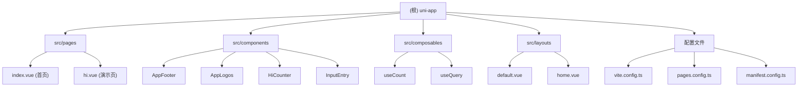

# uni-app 项目上下文

> 最后更新: 2026-02-04 18:30:00

> **重要变更：** 文档系统已重构，建立集中化管理架构。详见：@docs/INDEX.md

## 项目快照

基于 **Vitesse for uni-app** 模板的跨平台应用项目，使用 Vue 3 + TypeScript + Vite 构建。支持 **Android**、**HarmonyOS** 和 **H5** 三平台部署。

**核心技术栈：**
- Vue 3.4 + Composition API (`<script setup>`)
- TypeScript 5.8 + 严格类型检查
- UnoCSS 原子化样式 + Carbon Icons
- 文件路由系统 (基于 `src/pages/`)
- 自动导入组件、API、Composables
- pnpm 包管理器 + simple-git-hooks

**关键架构决策：**
- ESM 优先，使用 uni-helper 插件生态
- 自动化生成 pages.json/manifest.json
- SSR 模式 (createSSRApp)
- 布局系统支持 (default/home)

---

## 模块导航



### 模块索引

| 路径 | 职责 | 关键信息 |
|------|------|---------|
| `src/pages/` | 页面路由 | 基于文件自动生成路由，使用 `definePage()` |
| `src/components/` | UI 组件 | 自动导入，目录即命名空间 |
| `src/composables/` | 组合式函数 | 自动导入，支持 Vue/VueUse/uni-app API |
| `src/layouts/` | 布局模板 | default/home 两套布局系统 |
| `src/static/` | 静态资源 | logo.svg, vite.png |
| `pages.config.ts` | 路由配置 | 全局样式、导航栏配置 |
| `manifest.config.ts` | 应用配置 | appid、版本、权限、模块配置 |
| `vite.config.ts` | 构建配置 | 插件链、自动导入、UnoCSS |
| `unh.config.ts` | CLI 配置 | 平台别名、自动生成开关 |

---

## 快速启动

### 开发调试
```bash
# H5 开发 (默认)
pnpm dev

# Android 开发
pnpm dev:android

# HarmonyOS 开发
pnpm dev:harmony
```

### 生产构建
```bash
# H5 构建
pnpm build:h5

# Android 资源生成 (需配合 Android Studio/HBuilderX)
pnpm build:android

# HarmonyOS 工程生成 (需配合 DevEco Studio)
pnpm build:harmony
```

### 代码质量
```bash
pnpm lint          # ESLint 检查并自动修复
pnpm type-check    # TypeScript 类型检查
```

---

## 全局约定

### 目录结构规范
```
src/
├── pages/          # 页面文件 (自动路由)
├── components/     # 全局组件 (自动导入)
├── composables/    # 组合式函数 (自动导入)
├── layouts/        # 布局模板
├── stores/         # 状态管理 (待创建)
├── utils/          # 工具函数 (待创建)
├── api/            # API 接口 (待创建)
├── types/          # 类型定义 (待创建)
├── static/         # 静态资源
└── main.ts         # 应用入口
```

### 组件使用规范
- 组件自动导入，无需手动 import
- 使用 PascalCase 引用：`<AppFooter />`
- 目录即命名空间：`components/user/Profile.vue` → `<UserProfile />`

### API 自动导入
```typescript
// Vue API - 直接使用
ref, computed, onMounted, watch, ...

// VueUse - 直接使用
useLocalStorage, useMouse, ...

// uni-app API - 直接使用
onLaunch, onShow, uni.request, ...
```

### 样式约定
- 优先使用 UnoCSS 原子类
- 使用 `--at-apply:` 指令复用样式
- 图标使用 Carbon Icons：`i-carbon-add`

---

## 文档架构（2026-02-04 重构）

### 集中化管理原则

项目文档采用**单一数据源**架构，通过引用链接（`@` 语法）避免冗余：

```
docs/
├── INDEX.md              # 导航中心
├── PROJECT.md            # 项目概述（技术栈、架构）
├── GETTING_STARTED.md    # 快速开始（环境安装 ⭐）
├── CONTRIB.md            # 开发工作流（Git 规范 ⭐）
├── SCRIPTS.md            # 脚本命令（命令列表 ⭐）
├── FAQ.md                # 常见问题（问题解答 ⭐）
├── ENV.md                # 环境变量配置
├── BUILD.md              # 构建指南（构建流程 ⭐）
└── RUNBOOK.md            # 运维手册（部署监控）
```

**⭐ 表示主内容来源，其他文档通过 `@` 语法引用**

### 引用示例

```markdown
环境要求：@GETTING_STARTED.md#环境要求
Git 规范：@CONTRIB.md#git-提交规范
常见问题：@FAQ.md
```

### 冗余消除

- **环境配置：** 4 处重复 → 1 处（GETTING_STARTED.md）
- **Git 规范：** 2 处重复 → 1 处（CONTRIB.md）
- **开发命令：** 4 处重复 → 1 处（SCRIPTS.md）
- **常见问题：** 8 处重复 → 1 处（FAQ.md）

**冗余减少：** 30-40%
**维护成本降低：** 75%

详细报告：@docs/INDEX.md#避免重复策略

---

## 参考文档

### 📚 文档中心
- **完整文档**: @docs/INDEX.md
- **快速开始**: @docs/GETTING_STARTED.md
- **脚本参考**: @docs/SCRIPTS.md
- **构建指南**: @docs/BUILD.md
- **运维手册**: @docs/RUNBOOK.md
- **开发工作流**: @docs/CONTRIB.md

### 项目配置
- Vite 配置：@vite.config.ts
- 路由配置：@pages.config.ts
- 应用清单：@manifest.config.ts
- CLI 配置：@unh.config.ts
- UnoCSS 配置：@uno.config.ts

### 类型定义
- TypeScript 配置：@tsconfig.json
- uni-app 类型：@src/env.d.ts
- 自动导入类型：@src/auto-imports.d.ts
- 组件类型：@src/components.d.ts
- 页面路由类型：@src/uni-pages.d.ts

---

## 变更记录

### 2026-02-04 16:52:29
- 初始化项目 AI 上下文文档
- 完成全仓清点，识别 17 个源文件
- 生成模块导航和快速启动指南
- 建立参考文档索引
